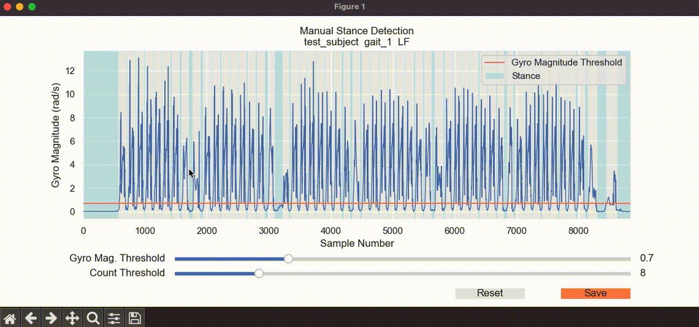
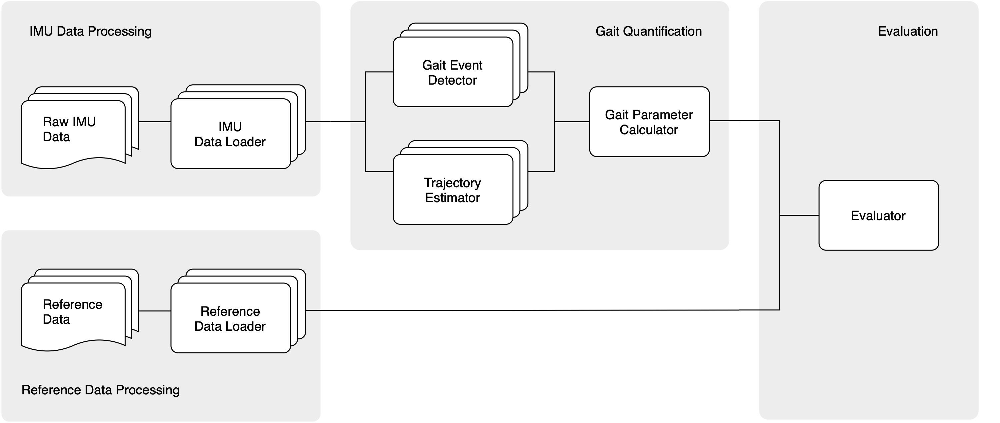
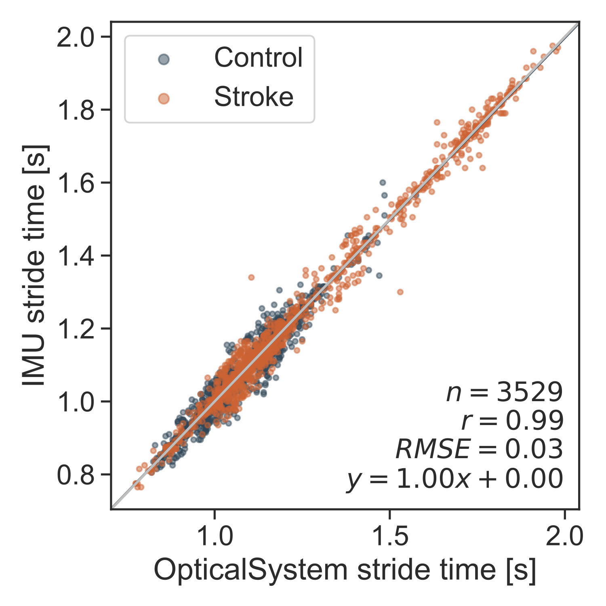
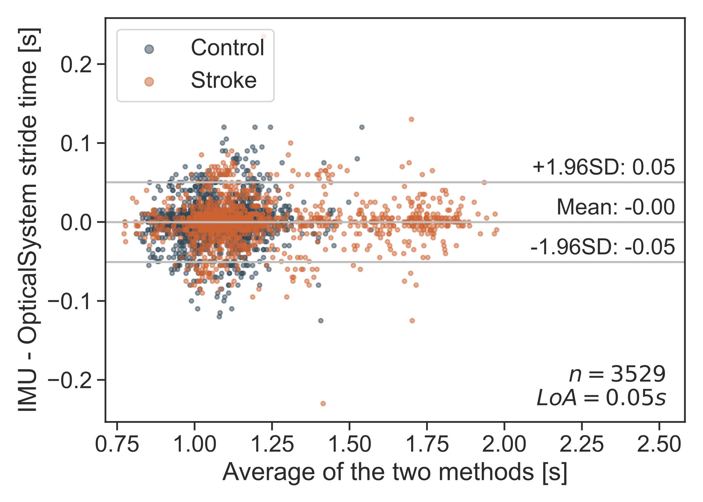
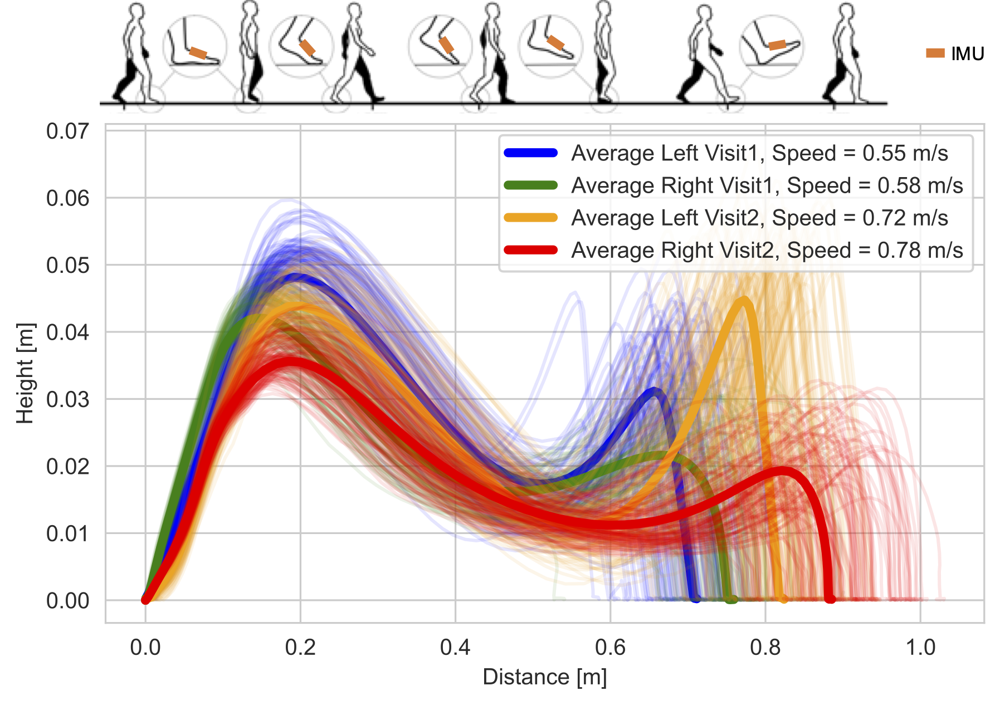
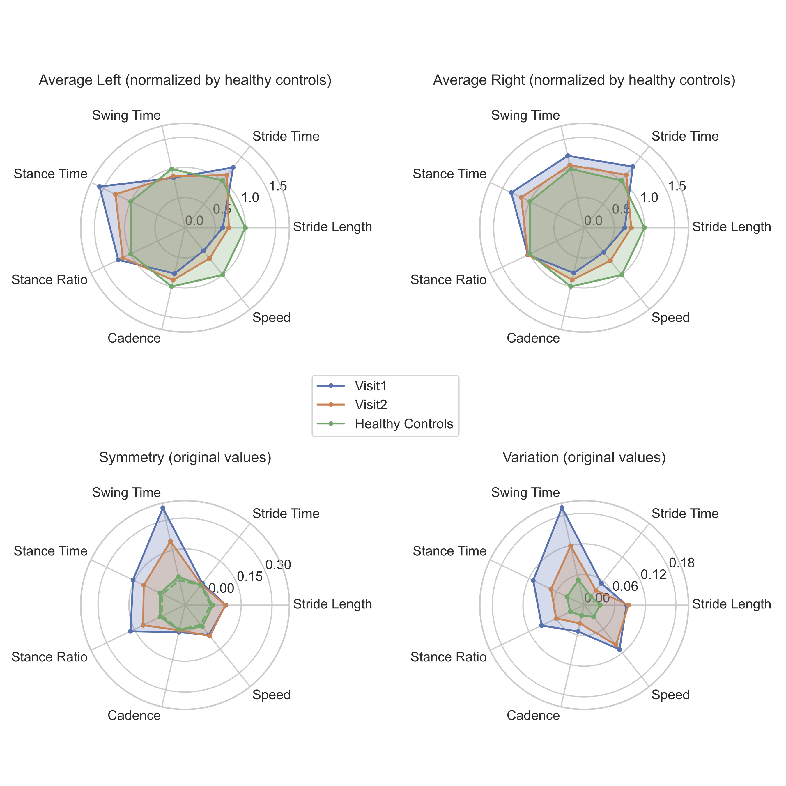
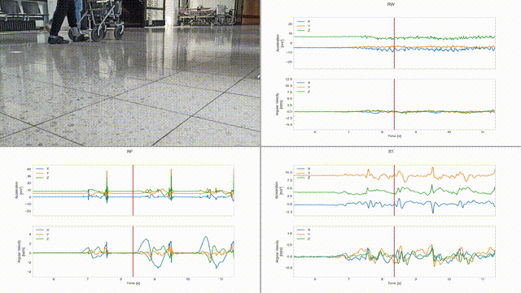

# IMU-Based Gait Analysis

This repository contains scripts for IMU-based gait analysis: 
* Calculating spatio-temporal gait paramters from raw IMU data
* Validating the gait parameters against reference systems using correlation analysis and Bland-Altman plots
* Visualizing the changes in gait patterns using foot movement trajectories and aggregated gait parameters
* Creating videos of synchromized video recording and sensor signals

## Getting started
### Getting the Project
```bash
git clone https://github.com/Linn39/imu_gait_analysis.git
```

### Setting up the Environment
Once you have the project on your local machine, you can set up the Conda environment using the `requirements.txt` file. 
```bash
conda create --name myenv --file requirements.txt python=3.9
conda activate myenv
```

Replace `myenv` with the name you want to give to your environment.

Alternatively, you can use pip to install the project requirements.


## Calculate spatio-temporal gait parameters
* Get example data from Zenodo: [StrokeGait](https://doi.org/10.5281/zenodo.10534054) or [DUO-Gait](https://doi.org/10.5281/zenodo.7415758), save the data in the project base directory. Remember to adapt the subject ID list according to the dataset. 
* Run ```src/main_LFRF_preprocessing.py``` to prepare the IMU data.
* Run ```src/main_gait_parameters_charite.py``` to calculate the gait parameters.
* Modify experiment settings in ```src/LFRF_parameters/pipeline_playground.py``` if needed.

### Example results
Manually inspecting the gyro threholds to recognize stance phases (when foot is stationary on the ground).
<p align="center">  </p>

### References
The algorithms are based on the following publications, with extended functionalities such as alternative algorithms, visualization of intermediate results for method development and debugging, and improved result plots. 
* Trautmann, J., Zhou, L., Brahms, C. M., Tunca, C., Ersoy, C., Granacher, U., & Arnrich, B. “Tripod--A Treadmill Walking Dataset With IMU, Pressure-Distribution and Photoelectric Data for Gait Analysis”. In: Data 6.9 (2021), p. 95.
* Zhou, L., Fischer, E., Brahms, C. M., Granacher, U., & Arnrich, B. “DUO-Gait: A Gait Dataset for Walking Under Dual-Task and Fatigue Conditions with Inertial Measurement Units”. In: Scientific Data 10.543 (2023), pp. 1-10.
* Zhou, L., Rackoll, T., Ekrod, L., Balc, M. G., Klostermann, F., Arnrich, B., & Nave, A. H. “Monitoring and Visualizing Stroke Rehabilitation Progress Using Wearable Sensors” (In Press). In: 2024 46th Annual International Conference of the IEEE Engineering in Medicine & Biology Society (EMBC). 2024. Vol. 2024-July.
* Tunca, Can, et al. "Inertial sensor-based robust gait analysis in non-hospital settings for neurological disorders." Sensors 17.4 (2017): 825.

## Validate gait quantification algorithms
* Get example data from Zenodo: [TRIPOD](https://doi.org/10.5281/zenodo.5070770). save the data in the project base directory.
* Run ```src/main_LFRF_preprocessing.py``` to prepare the IMU data.
* Run ```src/main_gait_parameters_TRIPOD.py``` to calculate the gait parameters and compare against reference systems.
* Modify experiment settings in ```src/LFRF_parameters/pipeline_playground.py``` if needed.

### Data processing pipeline
<p align="center"> 

### Example results
<p align="center">   </p>

### References
The algorithms are based on the following publications, with extended functionalities such as alternative algorithms, visualization of intermediate results for method development and debugging, and improved result plots. 
* Zhou, L., Tunca, C., Fischer, E., Brahms, C. M., Ersoy, C., Granacher, U., & Arnrich, B. “Validation of an IMU Gait Analysis Algorithm for Gait Monitoring in Daily Life Situations”. In: 2020 42nd Annual International Conference of the IEEE Engineering in Medicine & Biology Society (EMBC). 2020, pp. 4229-4232.
* Zhou, L., Fischer, E., Tunca, C., Brahms, C. M., Ersoy, C., Granacher, U., & Arnrich, B. “How We Found Our IMU: Guidelines to IMU Selection and a Comparison of Seven IMUs for Pervasive Healthcare Applications”. In: Sensors 20.15 (2020), p. 4090.
* Trautmann, J., Zhou, L., Brahms, C. M., Tunca, C., Ersoy, C., Granacher, U., & Arnrich, B. “Tripod--A Treadmill Walking Dataset With IMU, Pressure-Distribution and Photoelectric Data for Gait Analysis”. In: Data 6.9 (2021), p. 95.

## Quantifying and visualizing gait changes
* Get example data from Zenodo: [StrokeGait](https://doi.org/10.5281/zenodo.10534054), save the data in the project base directory.
* Run ```src/main_LFRF_preprocessing.py``` to prepare the IMU data.
* Run ```src/main_gait_parameters_charite.py``` to calculate the gait parameters.
* Run ```main_plot_aggregated_trajectories.py``` to visualize the foot movement trajectories.
* Run ```main_plot_gait_parameters.py``` to visualize the foot movement trajectories.

### Example results
<p align="center"> 
<p align="center"> 

### References
The algorithms are based on the following publication, with extended functionalities such as visualization of intermediate results for method development and debugging, and improved result plots. 
* Zhou, L., Rackoll, T., Ekrod, L., Balc, M. G., Klostermann, F., Arnrich, B., & Nave, A. H. “Monitoring and Visualizing Stroke Rehabilitation Progress Using Wearable Sensors” (In Press). In: 2024 46th Annual International Conference of the IEEE Engineering in Medicine & Biology Society (EMBC). 2024. Vol. 2024-July.

## Create sensor videos
This is used for presentations/demos.
- Trim the original video recording, so that it starts with the first initial contact of the right foot and has the deseired length. Save the trimmed video into ```./data/processed/sensor_video/video_trim_{sub}_{visit}.mp4```
- Run ```./src/main_sensor_videos.py``` to generate the IMU videos, which are saved in ```./data/processed/sensor_video/```
- Check the initial contact time for the IMU signal from the right foot, update config["imu_ic"]
- Run ```./src/main_sensor_videos.py``` again (comment out the part that generates the IMU videos, since the videos were already created in previous steps) to generate the merged video, which are saved in ```./data/processed/sensor_video/```
- Trim the final merged video if necessary

### Example results
Video recording with simultaneous raw IMU signals from the right wrist (RW), right foot (RF), and lower back (ST).
<p align="center">  </p>

## Project contributers
* Lin Zhou
* Justin Trautmann
* Eric Fischer
* Can Tunca